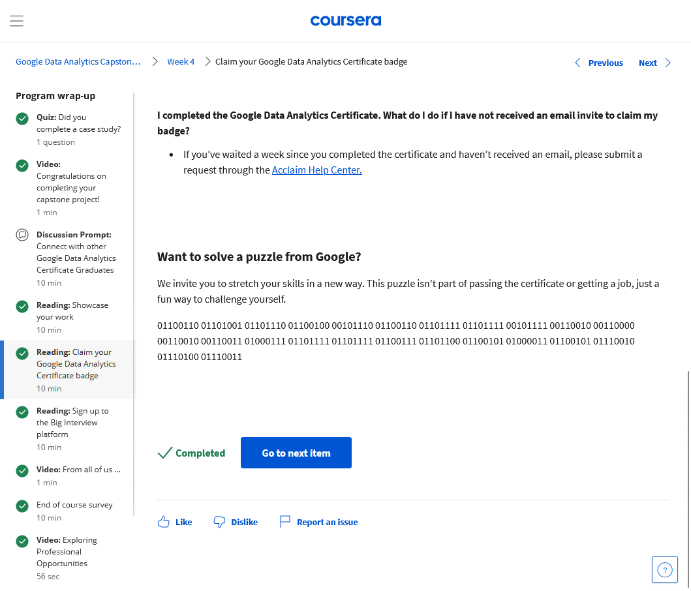
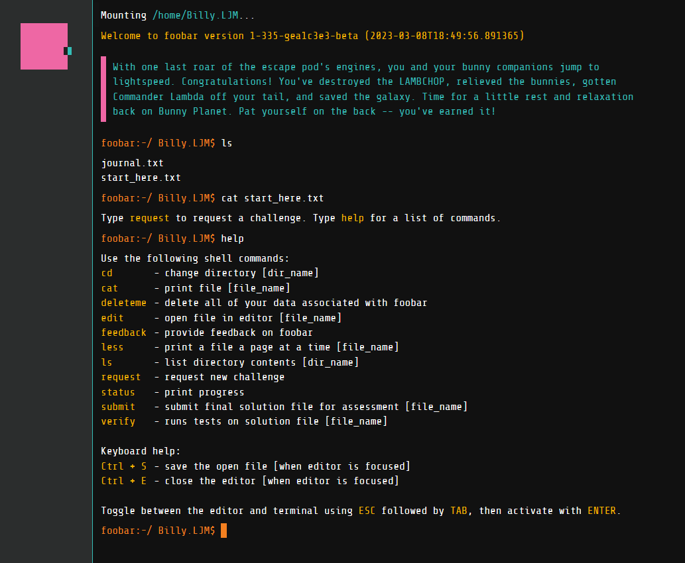

# Google FooBar Challenge  
  
  
  
These are my solutions for the [Google Foobar Challenge](https://foobar.withgoogle.com/)  
It is a coding challenge by Google which is supposedly invite-only *(but I seem to have a general link! Below!)*  
You do get a prompt to [provide your details](recruitment.txt) to a Google recruiter, but there are many people who have also posted solutions online but don't seem to be working at Google.  
Nevertheless the challenges are definitely fun to do, and you'd likely learn something by going through them.  
  
## How Did I get Invited  
  
I was doing the [Google Data Analytics certificate](https://grow.google/certificates/data-analytics/) and at the end of all the courses, there was a cryptic binary string inviting me to a challenge.  
  
  
  
So I copied the binary string into a binary to ASCII converter and got a link: [find.foo/2023GoogleCerts](find.foo/2023GoogleCerts)  
  
Clicking on the link brought me to a website which emulated a unix terminal.  
I logged into my Google account to link the invite to it, and off I went solving the challenges!  
  
  
  
## Description  
  
There are 5 levels of challenges, with level 5 being the most difficult/mathy.  
And there can be multiple challenges for each level. Each are stored in their individual folders here.  
The challenges are explained by interacting with the terminal, and I've copied the relevant parts in the `readme.txt`.  
You can submit solutions in Java or Python, and I did the latter with the respective `solution.py`.  
  
| Num |               Title               |                             Solutions                              |              Concepts               |  
|:---:|:---------------------------------:|:------------------------------------------------------------------:|:-----------------------------------:|  
| 1.1 | I Love Lance & Janice             | [`solution.py`](1.1_i-love-lance-janice/solution.py)               | Caesar Cipher                       |  
| 2.1 | En Route Salute                   | [`solution.py`](2.1_en-route-salute/solution.py)                   | Simulation                          |  
| 2.2 | Hey, I Already Did That!          | [`solution.py`](2.1_en-route-salute/solution.py)                   | Random Numbers                      |  
| 3.1 | Prepare the Bunnies' Escape       | [`solution.py`](3.1_prepare-the-bunnies-escape/solution.py)        | Breadth-First Search                |  
| 3.2 | Fuel Injection Perfection         | [`solution.py`](3.2_fuel-injection-perfection/solution.py)         | Binary Numbers                      |  
| 3.3 | Doomsday Fuel                     | [`solution.py`](3.3_doomsday-fuel/solution.py)                     | Markov Chain                        |  
| 4.1 | Distract the Trainers             | [`solution.py`](4.1_distract_the_trainers/solution.py)             | Number Theory, Maximum Matchings |  
| 4.2 | Bringing a Gun to a Trainer Fight | [`solution.py`](4.2_bringing-a-gun-to-a-trainer-fight/solution.py) | Geometry                            |  
| 5.1 | Dodge the Lasers!                 | [`solution.py`](5.1_dodge-the-lasers/solution.py)                  | Beatty Sequences                    |  
  
## Rewards  
  
 - **Level 2**: one invite link (for the same challenge)  
 - **Level 3**: submit your details to a Google recruiter  
 - **Level 4**: another invite link (for the same challenge)  
 - **Level 4**: the promise of more challenges in the future  